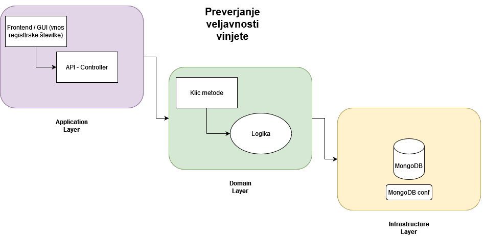

# Java Quarkus microservice - Veljavnost

| Funkcionalne zahteve                          | Nefunkcionalne zahteve |
|:----------------------------------------------|    :----:   |
| Omogoča preverjanje veljavnosti               | Preverjanje veljavnosti traja manj kot 30 sekund |
| Preverja se lahko več registrskih tablic hkrati | Preverja se lahko več vinjet hkrati |
| Za lažje delo imamo uporabniški vmesnik       | Shrani se podatek o preverjanju |

